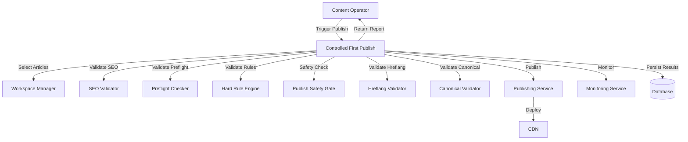
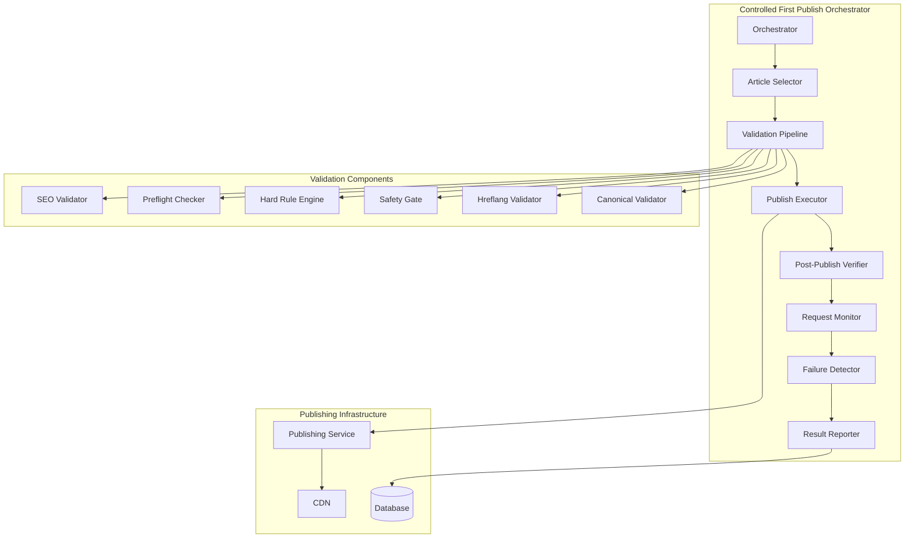
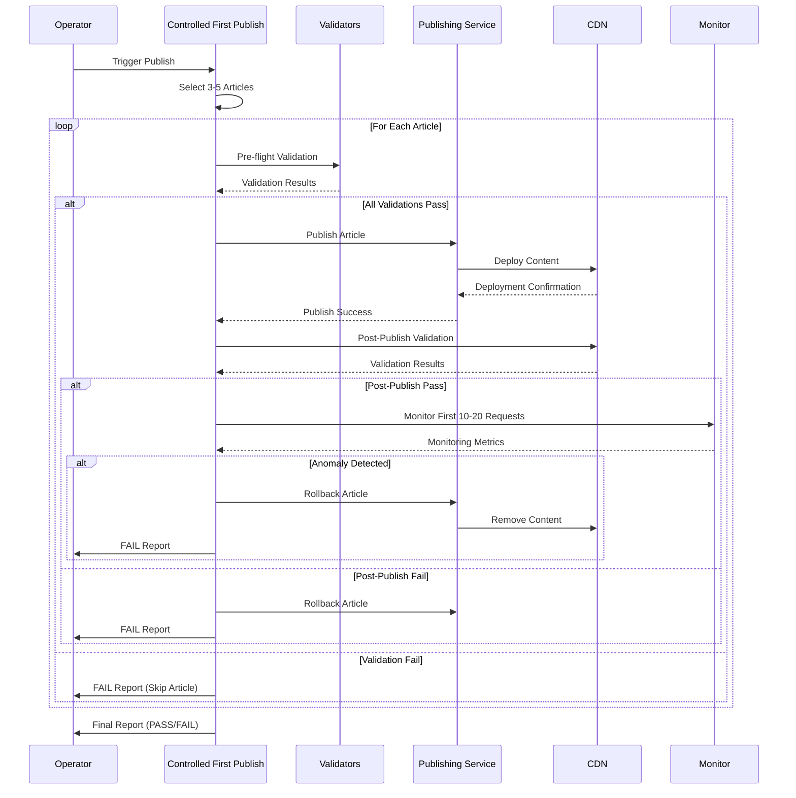

# Design Document: Controlled First Publish

## Overview

The Controlled First Publish feature implements a safety-critical publishing workflow that validates and publishes 3-5 articles to production with comprehensive pre-flight validation, post-publish verification, and real-time monitoring. The system acts as a multi-stage validation gate that ensures only high-quality, validated content reaches production, with per-article monitoring and automatic failure detection.

### Key Design Principles

1. **Fail-Fast Architecture**: Stop immediately on any validation failure
2. **Per-Article Isolation**: Track validation and monitoring metrics independently for each article
3. **Comprehensive Validation**: Multi-stage validation (SEO, preflight, hard-rules, safety gate, hreflang, canonical)
4. **Real-Time Monitoring**: Track first 10-20 requests per article to detect anomalies
5. **Automatic Rollback**: Remove published content if post-publish validation or monitoring fails
6. **Audit Trail**: Persist all validation results and monitoring data for compliance

### Scope

**In Scope:**
- Article selection (3-5 articles with SEO PASS)
- Pre-flight validation (SEO, preflight, hard-rules, safety gate, hreflang, canonical)
- Publish execution to CDN
- Post-publish validation (CDN 200, content rendering, language mapping, duplicate detection)
- Per-article monitoring (blocked rate, error rate, hard-rule violations)
- Failure detection and rollback
- Result reporting with detailed metrics

**Out of Scope:**
- Article content generation
- SEO optimization recommendations
- Manual approval workflows
- A/B testing or gradual rollout
- Performance optimization beyond monitoring

## Architecture

### System Context



### Component Architecture



### Data Flow



## Components and Interfaces

### 1. Controlled First Publish Orchestrator

**Responsibility**: Coordinates the entire publish workflow, managing article selection, validation, publishing, monitoring, and result reporting.

**Interface**:
```typescript
interface ControlledFirstPublishOrchestrator {
  /**
   * Execute controlled publish workflow for 3-5 articles
   * @returns PublishReport with overall status and per-article results
   */
  execute(): Promise<PublishReport>
}

interface PublishReport {
  status: 'PASS' | 'FAIL'
  timestamp: string
  articlesProcessed: number
  articlesPublished: number
  articlesFailed: number
  articleResults: ArticlePublishResult[]
  aggregateMetrics: AggregateMetrics
}

interface ArticlePublishResult {
  articleId: string
  status: 'PASS' | 'FAIL'
  stage: PublishStage
  cdnUrl?: string
  publishTimestamp?: string
  failureReason?: string
  validationResults: ValidationResults
  monitoringMetrics?: MonitoringMetrics
  rollbackStatus?: RollbackStatus
}

type PublishStage = 
  | 'selection'
  | 'preflight'
  | 'publish'
  | 'post-publish'
  | 'monitoring'
  | 'complete'

interface ValidationResults {
  seo: ValidationResult
  preflight: ValidationResult
  hardRules: ValidationResult
  safetyGate: ValidationResult
  hreflang: ValidationResult
  canonical: ValidationResult
  cdn?: ValidationResult
  content?: ValidationResult
  language?: ValidationResult
}

interface ValidationResult {
  pass: boolean
  issues: string[]
  severity?: 'HIGH' | 'MEDIUM' | 'LOW'
  timestamp: string
}

interface MonitoringMetrics {
  totalRequests: number
  blockedRequests: number
  errorRequests: number
  hardRuleViolations: number
  blockedRate: number
  errorRate: number
  avgResponseTime: number
  monitoringWindowStart: string
  monitoringWindowEnd: string
}

interface AggregateMetrics {
  totalArticlesProcessed: number
  totalArticlesPublished: number
  totalArticlesFailed: number
  totalValidationFailures: number
  totalMonitoringFailures: number
  totalRollbacks: number
}

interface RollbackStatus {
  attempted: boolean
  success: boolean
  timestamp: string
  error?: string
}
```

### 2. Article Selector

**Responsibility**: Selects 3-5 articles that pass SEO validation.

**Interface**:
```typescript
interface ArticleSelector {
  /**
   * Select 3-5 articles with SEO PASS status
   * @returns Array of selected articles (3-5 articles)
   */
  selectArticles(): Promise<SelectedArticle[]>
}

interface SelectedArticle {
  id: string
  languages: string[]
  status: string
  created_at: string
  seoValidation: ValidationResult
  [key: string]: any // Language-specific content fields
}
```

### 3. Validation Pipeline

**Responsibility**: Executes all pre-flight validation checks in sequence.

**Interface**:
```typescript
interface ValidationPipeline {
  /**
   * Execute all validation checks for an article
   * @param article Article to validate
   * @returns Validation results for all checks
   */
  validate(article: SelectedArticle): Promise<ValidationResults>
}

interface Validator {
  /**
   * Validate article against specific criteria
   * @param article Article to validate
   * @returns Validation result
   */
  validate(article: SelectedArticle): Promise<ValidationResult>
}

// Specific validators
interface SEOValidator extends Validator {}
interface PreflightChecker extends Validator {}
interface HardRuleEngine extends Validator {}
interface PublishSafetyGate extends Validator {}
interface HreflangValidator extends Validator {}
interface CanonicalValidator extends Validator {}
```

### 4. Publish Executor

**Responsibility**: Publishes validated articles to CDN.

**Interface**:
```typescript
interface PublishExecutor {
  /**
   * Publish article to CDN
   * @param article Article to publish
   * @returns Publish result with CDN URL
   */
  publish(article: SelectedArticle): Promise<PublishResult>
}

interface PublishResult {
  success: boolean
  cdnUrl?: string
  timestamp?: string
  error?: string
}
```

### 5. Post-Publish Verifier

**Responsibility**: Verifies published content is accessible and correct.

**Interface**:
```typescript
interface PostPublishVerifier {
  /**
   * Verify published article at CDN
   * @param cdnUrl CDN URL to verify
   * @param article Original article for comparison
   * @returns Verification results
   */
  verify(cdnUrl: string, article: SelectedArticle): Promise<PostPublishResults>
}

interface PostPublishResults {
  cdn: ValidationResult
  content: ValidationResult
  language: ValidationResult
  duplicate: ValidationResult
}
```

### 6. Request Monitor

**Responsibility**: Monitors first 10-20 requests to published article and tracks metrics.

**Interface**:
```typescript
interface RequestMonitor {
  /**
   * Monitor first 10-20 requests to published article
   * @param cdnUrl CDN URL to monitor
   * @param requestCount Number of requests to monitor (10-20)
   * @returns Monitoring metrics
   */
  monitor(cdnUrl: string, requestCount: number): Promise<MonitoringMetrics>
}
```

### 7. Failure Detector

**Responsibility**: Evaluates monitoring metrics and detects failure conditions.

**Interface**:
```typescript
interface FailureDetector {
  /**
   * Detect failure conditions from monitoring metrics
   * @param metrics Monitoring metrics to evaluate
   * @returns Failure detection result
   */
  detectFailures(metrics: MonitoringMetrics): FailureDetectionResult
}

interface FailureDetectionResult {
  failed: boolean
  reasons: string[]
  severity: 'HIGH' | 'MEDIUM' | 'LOW'
}
```

### 8. Result Reporter

**Responsibility**: Generates comprehensive result reports and persists audit data.

**Interface**:
```typescript
interface ResultReporter {
  /**
   * Generate final publish report
   * @param results Array of article publish results
   * @returns Comprehensive publish report
   */
  generateReport(results: ArticlePublishResult[]): PublishReport
  
  /**
   * Persist report to database for audit
   * @param report Report to persist
   */
  persistReport(report: PublishReport): Promise<void>
}
```

## Data Models

### Article Data Model

```typescript
interface Article {
  id: string
  status: 'draft' | 'sealed' | 'deployed' | 'rolled_back'
  languages: string[]
  created_at: string
  updated_at: string
  
  // Language-specific fields (dynamic)
  [lang: `${string}_title`]: string
  [lang: `${string}_content`]: string
  [lang: `${string}_summary`]: string
  [lang: `${string}_slug`]: string
  
  // Metadata
  category?: string
  tags?: string[]
  author?: string
}
```

### Publish Record Data Model

```typescript
interface PublishRecord {
  id: string
  article_id: string
  cdn_url: string
  status: 'published' | 'rolled_back'
  publish_timestamp: string
  rollback_timestamp?: string
  validation_results: ValidationResults
  monitoring_metrics?: MonitoringMetrics
  failure_reason?: string
}
```

### Monitoring Event Data Model

```typescript
interface MonitoringEvent {
  id: string
  article_id: string
  cdn_url: string
  timestamp: string
  request_number: number
  status_code: number
  response_time: number
  blocked: boolean
  error: boolean
  hard_rule_violation: boolean
  violation_details?: string
}
```

## Correctness Properties

*A property is a characteristic or behavior that should hold true across all valid executions of a system—essentially, a formal statement about what the system should do. Properties serve as the bridge between human-readable specifications and machine-verifiable correctness guarantees.*

### Property 1: Article Selection Bounds

*For any* execution of the controlled publish workflow, the number of articles selected SHALL be between 3 and 5 (inclusive).

**Validates: Requirements 1.1**

### Property 2: SEO Validation Enforcement

*For any* article selected for publish, the article SHALL have passed SEO validation with no HIGH severity issues.

**Validates: Requirements 1.3, 1.4**

### Property 3: Pre-Flight Validation Completeness

*For any* article that proceeds to publish execution, all six pre-flight validation checks (SEO, preflight, hard-rules, safety gate, hreflang, canonical) SHALL have returned PASS status.

**Validates: Requirements 2.1, 2.2, 2.3, 2.4, 2.5, 2.6, 2.7, 2.9**

### Property 4: Publish Execution Atomicity

*For any* article that passes pre-flight validation, either the article SHALL be successfully published to CDN with a valid CDN URL, OR the publish SHALL fail and no CDN URL SHALL be recorded.

**Validates: Requirements 3.1, 3.2, 3.3**

### Property 5: Post-Publish Validation Completeness

*For any* article that is published to CDN, all four post-publish validation checks (CDN status, content rendering, language mapping, duplicate detection) SHALL be executed before proceeding to monitoring.

**Validates: Requirements 4.1, 4.2, 4.3, 4.4, 4.5, 4.10**

### Property 6: Monitoring Window Bounds

*For any* article that passes post-publish validation, the monitoring window SHALL track between 10 and 20 requests (inclusive).

**Validates: Requirements 5.1, 5.2, 5.3, 5.4**

### Property 7: Failure Detection Triggers Rollback

*For any* article where a failure condition is detected (unexpected BLOCKED status, error rate threshold exceeded, or incorrect rendering), the system SHALL initiate rollback and mark the article as ROLLED_BACK.

**Validates: Requirements 6.2, 6.3, 6.4, 10.1, 10.2, 10.3**

### Property 8: Result Report Completeness

*For any* completed publish workflow, the result report SHALL include overall status, timestamp, article count metrics, and per-article results with validation and monitoring data.

**Validates: Requirements 7.1, 7.2, 7.3, 7.4, 7.5**

### Property 9: Duplicate Prevention

*For any* article that has already been published (exists in publish records), attempting to publish the same article again SHALL result in FAIL status with duplicate detection details.

**Validates: Requirements 9.1, 9.2, 9.3**

### Property 10: Monitoring Metrics Aggregation

*For any* article that completes the monitoring window, the aggregate metrics (blocked rate, error rate, total violations, average response time) SHALL be calculated from all monitored requests.

**Validates: Requirements 8.1, 8.2, 8.3, 8.4**

### Property 11: Per-Article Isolation

*For any* two articles in the same publish batch, a validation failure or monitoring failure in one article SHALL NOT affect the validation or monitoring of the other article.

**Validates: Requirements 1.1, 5.1, 6.1**

### Property 12: Rollback Idempotency

*For any* article that requires rollback, executing rollback multiple times SHALL result in the same final state (article removed from CDN, status ROLLED_BACK).

**Validates: Requirements 10.1, 10.2, 10.3**

## Error Handling

### Error Categories

1. **Validation Errors**: SEO validation failure, preflight check failure, hard-rule violations
2. **Publish Errors**: CDN deployment failure, network errors, timeout errors
3. **Post-Publish Errors**: CDN 404/500 errors, content rendering errors, language mapping errors
4. **Monitoring Errors**: Unexpected BLOCKED status, error rate threshold exceeded, hard-rule violations
5. **Rollback Errors**: CDN removal failure, database update failure

### Error Handling Strategy

```typescript
interface ErrorHandler {
  /**
   * Handle errors at different stages of the workflow
   * @param error Error to handle
   * @param context Context information (stage, article ID, etc.)
   * @returns Error handling result
   */
  handleError(error: Error, context: ErrorContext): ErrorHandlingResult
}

interface ErrorContext {
  stage: PublishStage
  articleId: string
  cdnUrl?: string
  attemptNumber: number
}

interface ErrorHandlingResult {
  action: 'retry' | 'skip' | 'abort' | 'rollback'
  reason: string
  retryAfter?: number
}
```

### Error Handling Rules

1. **Validation Errors**: Skip article, continue with next article, include in failure report
2. **Publish Errors**: Retry up to 3 times with exponential backoff, then skip article
3. **Post-Publish Errors**: Initiate rollback, mark article as ROLLED_BACK, include in failure report
4. **Monitoring Errors**: Initiate rollback, mark article as ROLLED_BACK, include in failure report
5. **Rollback Errors**: Log error, mark rollback as failed, include in failure report, alert operator

### Retry Strategy

```typescript
interface RetryStrategy {
  maxAttempts: number
  initialDelay: number
  maxDelay: number
  backoffMultiplier: number
  retryableErrors: string[]
}

const DEFAULT_RETRY_STRATEGY: RetryStrategy = {
  maxAttempts: 3,
  initialDelay: 1000, // 1 second
  maxDelay: 10000, // 10 seconds
  backoffMultiplier: 2,
  retryableErrors: [
    'NETWORK_ERROR',
    'TIMEOUT_ERROR',
    'CDN_UNAVAILABLE',
    'RATE_LIMIT_ERROR'
  ]
}
```

## Testing Strategy

### Unit Testing

**Objective**: Verify individual component behavior with specific examples and edge cases.

**Test Coverage**:

1. **Article Selector**:
   - Test selection of exactly 3 articles when 3 SEO-PASS articles available
   - Test selection of exactly 5 articles when 10 SEO-PASS articles available
   - Test failure when fewer than 3 SEO-PASS articles available
   - Test SEO validation filtering (HIGH severity issues rejected)

2. **Validation Pipeline**:
   - Test each validator independently with valid and invalid articles
   - Test validation pipeline short-circuits on first failure
   - Test validation results aggregation

3. **Publish Executor**:
   - Test successful publish returns CDN URL
   - Test publish failure returns error details
   - Test retry logic with transient failures

4. **Post-Publish Verifier**:
   - Test CDN 200 status verification
   - Test CDN 404/500 error detection
   - Test content rendering verification
   - Test language mapping verification
   - Test duplicate detection

5. **Request Monitor**:
   - Test monitoring exactly 10 requests
   - Test monitoring exactly 20 requests
   - Test blocked rate calculation
   - Test error rate calculation
   - Test hard-rule violation tracking

6. **Failure Detector**:
   - Test detection of unexpected BLOCKED status
   - Test detection of error rate threshold exceeded
   - Test detection of incorrect rendering
   - Test no failure when all metrics normal

7. **Result Reporter**:
   - Test report generation with all PASS articles
   - Test report generation with mixed PASS/FAIL articles
   - Test report generation with all FAIL articles
   - Test aggregate metrics calculation

### Property-Based Testing

**Objective**: Verify universal properties hold across all valid inputs using randomized testing.

**Test Framework**: fast-check (TypeScript property-based testing library)

**Test Configuration**:
- Minimum 100 iterations per property test
- Each test tagged with feature name and property number

**Property Tests**:

1. **Property 1: Article Selection Bounds**
   ```typescript
   // Feature: controlled-first-publish, Property 1: Article Selection Bounds
   // For any execution, selected articles count is between 3 and 5
   ```

2. **Property 2: SEO Validation Enforcement**
   ```typescript
   // Feature: controlled-first-publish, Property 2: SEO Validation Enforcement
   // For any selected article, SEO validation passed with no HIGH issues
   ```

3. **Property 3: Pre-Flight Validation Completeness**
   ```typescript
   // Feature: controlled-first-publish, Property 3: Pre-Flight Validation Completeness
   // For any article proceeding to publish, all 6 validations passed
   ```

4. **Property 4: Publish Execution Atomicity**
   ```typescript
   // Feature: controlled-first-publish, Property 4: Publish Execution Atomicity
   // For any article, either (success AND cdnUrl) OR (failure AND no cdnUrl)
   ```

5. **Property 5: Post-Publish Validation Completeness**
   ```typescript
   // Feature: controlled-first-publish, Property 5: Post-Publish Validation Completeness
   // For any published article, all 4 post-publish checks executed
   ```

6. **Property 6: Monitoring Window Bounds**
   ```typescript
   // Feature: controlled-first-publish, Property 6: Monitoring Window Bounds
   // For any monitored article, request count is between 10 and 20
   ```

7. **Property 7: Failure Detection Triggers Rollback**
   ```typescript
   // Feature: controlled-first-publish, Property 7: Failure Detection Triggers Rollback
   // For any article with failure condition, rollback initiated and status ROLLED_BACK
   ```

8. **Property 8: Result Report Completeness**
   ```typescript
   // Feature: controlled-first-publish, Property 8: Result Report Completeness
   // For any completed workflow, report includes status, timestamp, counts, and per-article results
   ```

9. **Property 9: Duplicate Prevention**
   ```typescript
   // Feature: controlled-first-publish, Property 9: Duplicate Prevention
   // For any already-published article, re-publish attempt returns FAIL with duplicate detection
   ```

10. **Property 10: Monitoring Metrics Aggregation**
    ```typescript
    // Feature: controlled-first-publish, Property 10: Monitoring Metrics Aggregation
    // For any monitored article, aggregate metrics calculated from all monitored requests
    ```

11. **Property 11: Per-Article Isolation**
    ```typescript
    // Feature: controlled-first-publish, Property 11: Per-Article Isolation
    // For any two articles, failure in one does not affect the other
    ```

12. **Property 12: Rollback Idempotency**
    ```typescript
    // Feature: controlled-first-publish, Property 12: Rollback Idempotency
    // For any article, multiple rollback executions result in same final state
    ```

### Integration Testing

**Objective**: Verify end-to-end workflow with real dependencies.

**Test Scenarios**:

1. **Happy Path**: 3 articles, all validations pass, all monitoring pass, all published successfully
2. **Partial Success**: 5 articles, 3 pass all stages, 2 fail at different stages
3. **All Fail**: 3 articles, all fail at validation stage
4. **Post-Publish Failure**: 3 articles, all pass validation, 1 fails post-publish verification, rollback triggered
5. **Monitoring Failure**: 3 articles, all pass validation and post-publish, 1 fails monitoring, rollback triggered
6. **Duplicate Detection**: Attempt to publish already-published article, duplicate detection prevents re-publish
7. **Rollback Failure**: Simulate rollback failure, verify error logged and included in report

### Test Data Generation

**Property Test Generators**:

```typescript
// Generate random article with configurable validation status
const arbitraryArticle = (seoPass: boolean, preflightPass: boolean): fc.Arbitrary<Article>

// Generate random validation result
const arbitraryValidationResult = (): fc.Arbitrary<ValidationResult>

// Generate random monitoring metrics
const arbitraryMonitoringMetrics = (): fc.Arbitrary<MonitoringMetrics>

// Generate random publish result
const arbitraryPublishResult = (): fc.Arbitrary<PublishResult>
```

### Mocking Strategy

**Unit Tests**: Mock all external dependencies (validators, publishing service, CDN, database)

**Property Tests**: Use mocks for external services, test pure logic with real data structures

**Integration Tests**: Use real dependencies where possible, mock only external services (CDN, third-party APIs)

## Implementation Notes

### Technology Stack

- **Language**: TypeScript
- **Testing Framework**: Jest
- **Property Testing**: fast-check
- **HTTP Client**: node-fetch or axios
- **Database**: PostgreSQL (via existing database module)
- **Logging**: Winston or existing logging infrastructure

### Performance Considerations

1. **Parallel Validation**: Execute independent validation checks in parallel to reduce latency
2. **Monitoring Sampling**: Monitor first 10-20 requests, not all requests (performance vs. coverage tradeoff)
3. **Database Batching**: Batch database writes for monitoring events to reduce I/O
4. **CDN Caching**: Leverage CDN cache headers to reduce origin load during monitoring

### Security Considerations

1. **Input Validation**: Validate all article data before processing
2. **SQL Injection Prevention**: Use parameterized queries for all database operations
3. **XSS Prevention**: Sanitize article content before rendering in verification
4. **Rate Limiting**: Implement rate limiting for CDN verification requests
5. **Audit Logging**: Log all publish operations, validation results, and rollback actions

### Observability

1. **Metrics**: Track publish success rate, validation failure rate, monitoring failure rate, rollback rate
2. **Logging**: Log all stages of workflow with structured logging (JSON format)
3. **Tracing**: Implement distributed tracing for end-to-end workflow visibility
4. **Alerting**: Alert on high failure rates, rollback failures, or unexpected errors

### Rollback Strategy

1. **CDN Removal**: Call CDN API to remove published content
2. **Database Update**: Mark article status as ROLLED_BACK
3. **Cache Invalidation**: Invalidate CDN cache for rolled-back article
4. **Audit Trail**: Persist rollback event with timestamp and reason

### Idempotency

1. **Duplicate Prevention**: Check publish records before publishing to prevent duplicates
2. **Rollback Idempotency**: Rollback operations are idempotent (safe to retry)
3. **Monitoring Idempotency**: Monitoring can be re-run without side effects

### Extensibility

1. **Pluggable Validators**: Validators implement common interface, easy to add new validators
2. **Configurable Thresholds**: Error rate thresholds, monitoring window size configurable
3. **Custom Failure Detectors**: Failure detection logic can be extended with custom rules
4. **Webhook Integration**: Result reporter can trigger webhooks for external integrations
