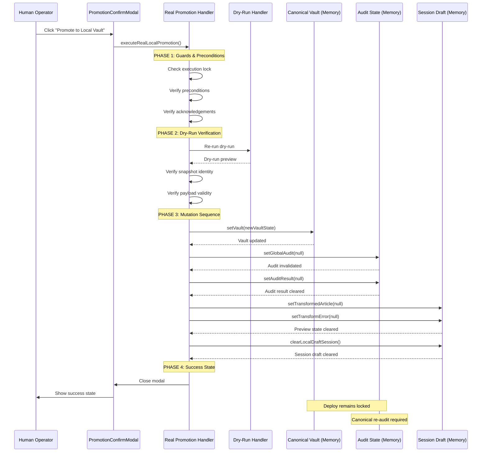

# Design Document: Task 6B-2B Real Local Promotion Execution

## Overview

Task 6B-2B implements the first controlled phase where session draft content may be promoted into the local canonical vault state in React memory only. This builds upon Task 6B-2A (dry-run promotion) by adding real local vault mutation with strict safety gates. The design ensures that promotion remains a memory-only operation with no backend persistence, no deploy unlock, and mandatory canonical audit invalidation.

This is a critical safety milestone: session draft content can now flow into the canonical vault, but only under strict human supervision with explicit acknowledgement, and only in local browser memory. Deploy remains locked, canonical audit is invalidated, and full protocol re-audit is required before any deployment can occur.

## Main Algorithm/Workflow



## Core Interfaces/Types

### Real Promotion Execution Input

```typescript
interface RealPromotionExecutionInput {
  // Dry-run preview result (must be successful)
  dryRunPreview: LocalPromotionDryRunPreview;
  
  // Current vault state reference
  currentVault: PandaPackage;
  
  // Session draft state reference
  localDraftCopy: PandaPackage;
  
  // State setters for mutation
  setVault: (vault: PandaPackage) => void;
  setGlobalAudit: (audit: GlobalAuditResult | null) => void;
  setAuditResult: (result: AuditResult | null) => void;
  setTransformedArticle: (article: FormattedArticle | null) => void;
  setTransformError: (error: string | null) => void;
  clearLocalDraftSession: () => void;
  
  // Execution control
  isPromotionExecuting: boolean;
  setIsPromotionExecuting: (executing: boolean) => void;
  
  // Modal control
  onClose: () => void;
}


### Real Promotion Execution Result

```typescript
type RealPromotionExecutionResult =
  | {
      success: true;
      promotedAt: string;
      vaultUpdated: true;
      auditInvalidated: true;
      sessionCleared: true;
      deployLocked: true;
      reAuditRequired: true;
    }
  | {
      success: false;
      blocked: true;
      reason: string;
      blockCategory: 'PRECONDITION' | 'DRY_RUN' | 'SNAPSHOT' | 'VAULT_MUTATION' | 'AUDIT_INVALIDATION' | 'SESSION_CLEAR';
      vaultUpdated: false;
      auditInvalidated: false;
      sessionCleared: false;
    };
```

## Key Functions with Formal Specifications

### Function 1: executeRealLocalPromotion()

```typescript
function executeRealLocalPromotion(input: RealPromotionExecutionInput): Promise<RealPromotionExecutionResult>
```

**Preconditions:**
- `input.dryRunPreview` is non-null and `dryRunPreview.isDryRun === true`
- `input.dryRunPreview.preview.success === true`
- `input.currentVault` is non-null and well-formed
- `input.localDraftCopy` is non-null and well-formed
- `input.isPromotionExecuting === false` (no concurrent execution)
- All state setters are valid functions
- Snapshot identity matches between dry-run and current state
- Operator acknowledgements are complete

**Postconditions:**
- If successful: `result.success === true` AND `result.vaultUpdated === true` AND `result.auditInvalidated === true` AND `result.sessionCleared === true` AND `result.deployLocked === true`
- If blocked: `result.success === false` AND `result.vaultUpdated === false` AND `result.auditInvalidated === false` AND `result.sessionCleared === false`
- Execution lock is released in all cases
- Modal is closed only on success
- No backend/API/database calls are made
- No localStorage/sessionStorage writes occur
- Deploy remains locked in all cases

**Loop Invariants:** N/A (no loops in main execution path)

### Function 2: verifyDryRunSuccess()

```typescript
function verifyDryRunSuccess(dryRunPreview: LocalPromotionDryRunPreview | null): boolean
```

**Preconditions:**
- `dryRunPreview` parameter is provided (may be null)

**Postconditions:**
- Returns `true` if and only if dry-run preview exists, is successful, and has valid safety invariants
- Returns `false` if dry-run preview is null, failed, or has invalid safety invariants
- No side effects on input parameter

**Loop Invariants:** N/A (pure function)

### Function 3: verifySnapshotFreshness()

```typescript
function verifySnapshotFreshness(
  dryRunSnapshot: SnapshotIdentity,
  currentDraftChecksum: string,
  currentLedgerSequence: number
): boolean
```

**Preconditions:**
- `dryRunSnapshot` is non-null and has valid `contentHash` and `ledgerSequence`
- `currentDraftChecksum` is non-empty string
- `currentLedgerSequence` is non-negative integer

**Postconditions:**
- Returns `true` if and only if snapshot content hash matches current checksum AND ledger sequences match
- Returns `false` if any mismatch is detected
- No side effects on input parameters

**Loop Invariants:** N/A (pure function)

## Algorithmic Pseudocode

### Main Promotion Execution Algorithm

```pascal
ALGORITHM executeRealLocalPromotion(input)
INPUT: input of type RealPromotionExecutionInput
OUTPUT: result of type RealPromotionExecutionResult

BEGIN
  // ========================================================================
  // PHASE 1: GUARDS & PRECONDITIONS
  // ========================================================================
  
  // Guard 1: Check execution lock
  IF input.isPromotionExecuting = true THEN
    RETURN {
      success: false,
      blocked: true,
      reason: "Promotion already executing",
      blockCategory: "PRECONDITION",
      vaultUpdated: false,
      auditInvalidated: false,
      sessionCleared: false
    }
  END IF
  
  // Set execution lock
  input.setIsPromotionExecuting(true)
  
  TRY
    // Guard 2: Verify dry-run preview exists and succeeded
    IF NOT verifyDryRunSuccess(input.dryRunPreview) THEN
      RETURN createBlockedResult("DRY_RUN", "Dry-run preview invalid or failed")
    END IF
    
    // Guard 3: Verify preconditions from dry-run
    precondition ← input.dryRunPreview.precondition
    IF NOT precondition.canPromote THEN
      RETURN createBlockedResult("PRECONDITION", "Preconditions not met")
    END IF
    
    // Guard 4: Verify operator acknowledgements
    ack ← precondition.acknowledgement
    IF NOT (ack.vaultReplacementAcknowledged AND 
            ack.auditInvalidationAcknowledged AND 
            ack.deployLockAcknowledged AND 
            ack.reAuditRequiredAcknowledged) THEN
      RETURN createBlockedResult("PRECONDITION", "Operator acknowledgements incomplete")
    END IF
    
    // Guard 5: Verify snapshot freshness
    dryRunSnapshot ← input.dryRunPreview.snapshotBinding.snapshotIdentity
    currentChecksum ← computeChecksum(input.localDraftCopy)
    currentLedgerSeq ← getCurrentLedgerSequence()
    
    IF NOT verifySnapshotFreshness(dryRunSnapshot, currentChecksum, currentLedgerSeq) THEN
      RETURN createBlockedResult("SNAPSHOT", "Snapshot stale - re-run dry-run required")
    END IF
    
    // Guard 6: Verify payload exists
    IF input.dryRunPreview.payload = null THEN
      RETURN createBlockedResult("DRY_RUN", "Promotion payload missing")
    END IF
    
    // ========================================================================
    // PHASE 2: DRY-RUN RE-VERIFICATION
    // ========================================================================
    
    // Re-run dry-run to ensure state hasn't changed
    freshDryRunInput ← buildDryRunInput(input)
    freshDryRunResult ← executeLocalPromotionDryRun(freshDryRunInput)
    
    IF NOT freshDryRunResult.success THEN
      RETURN createBlockedResult("DRY_RUN", "Fresh dry-run failed")
    END IF
    
    // Verify snapshot identity still matches
    IF NOT snapshotIdentitiesMatch(
      input.dryRunPreview.snapshotBinding.snapshotIdentity,
      freshDryRunResult.preview.snapshotBinding.snapshotIdentity
    ) THEN
      RETURN createBlockedResult("SNAPSHOT", "Snapshot changed during execution")
    END IF
    
    // ========================================================================
    // PHASE 3: MUTATION SEQUENCE (CRITICAL ORDERING)
    // ========================================================================
    
    // Step 1: Update canonical vault (FIRST MUTATION)
    TRY
      newVaultState ← input.localDraftCopy
      input.setVault(newVaultState)
    CATCH error
      RETURN createBlockedResult("VAULT_MUTATION", "Vault update failed: " + error.message)
    END TRY
    
    // Step 2: Invalidate canonical audit (SECOND MUTATION)
    TRY
      input.setGlobalAudit(null)
    CATCH error
      // CRITICAL: Vault already mutated, cannot rollback in this phase
      RETURN createBlockedResult("AUDIT_INVALIDATION", "Audit invalidation failed - vault mutated")
    END TRY
    
    // Step 3: Clear audit result (THIRD MUTATION)
    TRY
      input.setAuditResult(null)
    CATCH error
      // Non-critical: continue execution
      LOG_WARNING("Audit result clear failed: " + error.message)
    END TRY
    
    // Step 4: Clear transformed article preview (FOURTH MUTATION)
    TRY
      input.setTransformedArticle(null)
      input.setTransformError(null)
    CATCH error
      // Non-critical: continue execution
      LOG_WARNING("Preview state clear failed: " + error.message)
    END TRY
    
    // Step 5: Clear session draft (FINAL MUTATION)
    TRY
      input.clearLocalDraftSession()
    CATCH error
      // CRITICAL: Vault and audit already mutated
      RETURN createBlockedResult("SESSION_CLEAR", "Session clear failed - vault and audit mutated")
    END TRY
    
    // ========================================================================
    // PHASE 4: SUCCESS STATE
    // ========================================================================
    
    // Close modal
    input.onClose()
    
    // Return success result
    RETURN {
      success: true,
      promotedAt: getCurrentTimestamp(),
      vaultUpdated: true,
      auditInvalidated: true,
      sessionCleared: true,
      deployLocked: true,
      reAuditRequired: true
    }
    
  FINALLY
    // Always release execution lock
    input.setIsPromotionExecuting(false)
  END TRY
END
```

**Preconditions:**
- Input is validated and well-formed
- Execution lock is available (not already executing)
- Dry-run preview exists and is successful
- Snapshot identity is fresh

**Postconditions:**
- Execution lock is released in all cases
- If successful: vault updated, audit invalidated, session cleared, modal closed
- If blocked: no mutations performed (fail-closed)
- Deploy remains locked in all cases

**Loop Invariants:** N/A (sequential execution, no loops)

### Dry-Run Success Verification Algorithm

```pascal
ALGORITHM verifyDryRunSuccess(dryRunPreview)
INPUT: dryRunPreview of type LocalPromotionDryRunPreview or null
OUTPUT: isValid of type boolean

BEGIN
  // Check 1: Preview exists
  IF dryRunPreview = null THEN
    RETURN false
  END IF
  
  // Check 2: Preview indicates success
  IF dryRunPreview.success ≠ true THEN
    RETURN false
  END IF
  
  // Check 3: Preview has valid safety invariants
  safetyInvariants ← dryRunPreview.safetyInvariants
  
  IF safetyInvariants.dryRunOnly ≠ true THEN
    RETURN false
  END IF
  
  IF safetyInvariants.noExecution ≠ true THEN
    RETURN false
  END IF
  
  IF safetyInvariants.noMutation ≠ true THEN
    RETURN false
  END IF
  
  IF safetyInvariants.deployLocked ≠ true THEN
    RETURN false
  END IF
  
  IF safetyInvariants.canonicalReAuditRequired ≠ true THEN
    RETURN false
  END IF
  
  // Check 4: Preview has valid precondition
  IF dryRunPreview.precondition = null THEN
    RETURN false
  END IF
  
  IF dryRunPreview.precondition.canPromote ≠ true THEN
    RETURN false
  END IF
  
  // Check 5: Preview has valid snapshot binding
  IF dryRunPreview.snapshotBinding = null THEN
    RETURN false
  END IF
  
  IF dryRunPreview.snapshotBinding.snapshotIdentity = null THEN
    RETURN false
  END IF
  
  // All checks passed
  RETURN true
END
```

**Preconditions:**
- dryRunPreview parameter is provided (may be null, but parameter exists)

**Postconditions:**
- Returns boolean value indicating validity
- true if and only if preview passes all validation checks
- No side effects on input parameter

**Loop Invariants:** N/A (sequential checks, no loops)

### Snapshot Freshness Verification Algorithm

```pascal
ALGORITHM verifySnapshotFreshness(dryRunSnapshot, currentChecksum, currentLedgerSeq)
INPUT: dryRunSnapshot of type SnapshotIdentity
INPUT: currentChecksum of type string
INPUT: currentLedgerSeq of type integer
OUTPUT: isFresh of type boolean

BEGIN
  // Check 1: Snapshot exists
  IF dryRunSnapshot = null THEN
    RETURN false
  END IF
  
  // Check 2: Content hash matches
  IF dryRunSnapshot.contentHash ≠ currentChecksum THEN
    RETURN false
  END IF
  
  // Check 3: Ledger sequence matches
  IF dryRunSnapshot.ledgerSequence ≠ currentLedgerSeq THEN
    RETURN false
  END IF
  
  // All checks passed - snapshot is fresh
  RETURN true
END
```

**Preconditions:**
- dryRunSnapshot is non-null and has valid contentHash and ledgerSequence fields
- currentChecksum is non-empty string
- currentLedgerSeq is non-negative integer

**Postconditions:**
- Returns boolean value indicating freshness
- true if and only if snapshot matches current state
- No side effects on input parameters

**Loop Invariants:** N/A (sequential checks, no loops)

## Example Usage

```typescript
// Example 1: Successful real promotion execution
const dryRunPreview: LocalPromotionDryRunPreview = {
  // ... successful dry-run preview from Task 6B-2A
  success: true,
  isDryRun: true,
  precondition: { canPromote: true, /* ... */ },
  snapshotBinding: { /* ... */ },
  safetyInvariants: {
    dryRunOnly: true,
    noExecution: true,
    noMutation: true,
    deployLocked: true,
    canonicalReAuditRequired: true,
    // ...
  }
};

const input: RealPromotionExecutionInput = {
  dryRunPreview,
  currentVault: vault,
  localDraftCopy: sessionDraft,
  setVault,
  setGlobalAudit,
  setAuditResult,
  setTransformedArticle,
  setTransformError,
  clearLocalDraftSession,
  isPromotionExecuting: false,
  setIsPromotionExecuting,
  onClose: closeModal
};

const result = await executeRealLocalPromotion(input);

if (result.success) {
  console.log("Promotion successful");
  console.log("Vault updated:", result.vaultUpdated);
  console.log("Audit invalidated:", result.auditInvalidated);
  console.log("Session cleared:", result.sessionCleared);
  console.log("Deploy locked:", result.deployLocked);
  console.log("Re-audit required:", result.reAuditRequired);
} else {
  console.error("Promotion blocked:", result.reason);
  console.error("Block category:", result.blockCategory);
}

// Example 2: Blocked execution - concurrent execution
const blockedInput = {
  ...input,
  isPromotionExecuting: true // Already executing
};

const blockedResult = await executeRealLocalPromotion(blockedInput);
// blockedResult.success === false
// blockedResult.reason === "Promotion already executing"
// blockedResult.blockCategory === "PRECONDITION"

// Example 3: Blocked execution - stale snapshot
const staleInput = {
  ...input,
  dryRunPreview: {
    ...dryRunPreview,
    snapshotBinding: {
      snapshotIdentity: {
        contentHash: "old_hash", // Stale hash
        ledgerSequence: 5,
        latestAppliedEventId: null,
        timestamp: "2024-01-01T00:00:00Z"
      },
      checkedAt: "2024-01-01T00:00:00Z",
      preconditionsMet: true,
      blockReasons: []
    }
  }
};

const staleResult = await executeRealLocalPromotion(staleInput);
// staleResult.success === false
// staleResult.reason === "Snapshot stale - re-run dry-run required"
// staleResult.blockCategory === "SNAPSHOT"
```

## Correctness Properties

*A property is a characteristic or behavior that should hold true across all valid executions of a system—essentially, a formal statement about what the system should do. Properties serve as the bridge between human-readable specifications and machine-verifiable correctness guarantees.*

### Property 1: Execution Lock Safety

*For any* promotion execution input where the execution lock is unavailable, the promotion SHALL be blocked with "PRECONDITION" category and no mutations SHALL occur.

**Validates: Requirements 1.2, 1.4**

### Property 2: Dry-Run Success Requirement

*For any* promotion execution input where the dry-run preview is null, failed, or has invalid safety invariants, the promotion SHALL be blocked with "DRY_RUN" category.

**Validates: Requirements 2.1, 2.2, 2.3, 2.4, 2.7**

### Property 3: Snapshot Freshness Requirement

*For any* promotion execution input where the snapshot content hash or ledger sequence does not match the current state, the promotion SHALL be blocked with "SNAPSHOT" category.

**Validates: Requirements 3.1, 3.2, 3.3, 3.4, 3.5**

### Property 4: Operator Acknowledgement Requirement

*For any* promotion execution input where any required acknowledgement is incomplete, the promotion SHALL be blocked with "PRECONDITION" category.

**Validates: Requirements 4.1, 4.2, 4.3, 4.4, 4.5**

### Property 5: Mutation Ordering Invariant

*For any* successful promotion execution, mutations SHALL occur in the exact order: vault update → audit invalidation → audit result clear → preview clear → session clear.

**Validates: Requirements 5.1, 5.2, 5.3, 5.4, 5.5, 5.6**

### Property 6: Vault Mutation Correctness

*For any* promotion execution that reaches the mutation phase, the vault SHALL be updated with the session draft content, and if vault mutation fails, all subsequent mutations SHALL be prevented.

**Validates: Requirements 6.1, 6.2, 6.3, 6.4**

### Property 7: Audit Invalidation Correctness

*For any* successful vault mutation, the canonical audit SHALL be invalidated by setting it to null, and if audit invalidation fails, the error SHALL indicate vault is already mutated.

**Validates: Requirements 7.1, 7.2, 7.3, 7.4**

### Property 8: Session Clear Correctness

*For any* successful preview clear, the session draft SHALL be cleared, and if session clear fails, the error SHALL indicate vault and audit are already mutated.

**Validates: Requirements 8.1, 8.2, 8.3, 8.4**

### Property 9: Preview State Clear Correctness

*For any* successful audit result clear, the transformed article and transform error SHALL be cleared, and if preview clear fails, execution SHALL continue with a warning.

**Validates: Requirements 9.1, 9.2, 9.3, 19.1, 19.2, 19.3**

### Property 10: Fail-Closed Guarantee

*For any* promotion execution that is blocked or fails before mutations, no vault update, audit invalidation, or session clear SHALL occur.

**Validates: Requirements 10.1, 10.2, 10.3, 10.4**

### Property 11: Deploy Lock Preservation

*For any* promotion execution (successful or failed), the deploy lock SHALL remain locked and SHALL never be unlocked.

**Validates: Requirements 11.1, 11.2, 11.3**

### Property 12: No Backend Persistence

*For any* promotion execution, no calls to fetch, axios, prisma, libsql, localStorage, or sessionStorage SHALL occur, and all mutations SHALL be performed in React memory state only.

**Validates: Requirements 12.1, 12.2, 12.3, 12.4, 12.5**

### Property 13: Success Result Completeness

*For any* successful promotion execution, the result SHALL contain success=true, vaultUpdated=true, auditInvalidated=true, sessionCleared=true, deployLocked=true, reAuditRequired=true, and a valid promotedAt timestamp.

**Validates: Requirements 13.1, 13.2, 13.3, 13.4, 13.5, 13.6, 13.7**

### Property 14: Blocked Result Completeness

*For any* blocked promotion execution, the result SHALL contain success=false, blocked=true, a reason string, a blockCategory, vaultUpdated=false, auditInvalidated=false, and sessionCleared=false.

**Validates: Requirements 14.1, 14.2, 14.3, 14.4, 14.5, 14.6, 14.7**

### Property 15: Modal Control Correctness

*For any* promotion execution, the onClose callback SHALL be called if and only if the promotion succeeds.

**Validates: Requirements 15.1, 15.2, 15.3**

### Property 16: Execution Lock Release Invariant

*For any* promotion execution (successful, blocked, or failed), the execution lock SHALL be released after execution completes.

**Validates: Requirements 1.3, 1.4**

### Property 17: Performance Constraint

*For any* promotion execution with typical session draft sizes (10-20 languages, 5-10 remediation events), execution SHALL complete within 500 milliseconds.

**Validates: Requirements 1.5, 20.3**

### Property 18: Dry-Run Re-Verification

*For any* promotion execution that passes initial guards, a fresh dry-run SHALL be executed to verify state has not changed, and if the fresh dry-run fails or snapshot identity changes, promotion SHALL be blocked.

**Validates: Requirements 2.6, 2.7, 3.5**

## Error Handling

### Error Scenario 1: Concurrent Execution Attempt

**Condition**: `isPromotionExecuting === true` when promotion is triggered
**Response**: Immediately return blocked result with "PRECONDITION" category
**Recovery**: User must wait for current execution to complete before retrying

### Error Scenario 2: Dry-Run Preview Invalid

**Condition**: Dry-run preview is null, failed, or has invalid safety invariants
**Response**: Return blocked result with "DRY_RUN" category
**Recovery**: User must re-run dry-run promotion to generate fresh preview

### Error Scenario 3: Snapshot Stale

**Condition**: Snapshot content hash or ledger sequence does not match current state
**Response**: Return blocked result with "SNAPSHOT" category
**Recovery**: User must re-run dry-run promotion to capture fresh snapshot

### Error Scenario 4: Preconditions Not Met

**Condition**: Precondition check indicates `canPromote === false`
**Response**: Return blocked result with "PRECONDITION" category
**Recovery**: User must resolve precondition failures (re-audit, fix errors, etc.)

### Error Scenario 5: Operator Acknowledgements Incomplete

**Condition**: Any required acknowledgement is false
**Response**: Return blocked result with "PRECONDITION" category
**Recovery**: User must provide all required acknowledgements in modal

### Error Scenario 6: Vault Mutation Failure

**Condition**: `setVault()` throws error or fails
**Response**: Return blocked result with "VAULT_MUTATION" category, no mutations performed
**Recovery**: User must investigate vault state and retry

### Error Scenario 7: Audit Invalidation Failure

**Condition**: `setGlobalAudit(null)` throws error after vault mutation
**Response**: Return blocked result with "AUDIT_INVALIDATION" category, vault already mutated
**Recovery**: Critical error - user must manually verify audit state and vault consistency

### Error Scenario 8: Session Clear Failure

**Condition**: `clearLocalDraftSession()` throws error after vault and audit mutations
**Response**: Return blocked result with "SESSION_CLEAR" category, vault and audit already mutated
**Recovery**: Critical error - user must manually clear session draft

### Error Scenario 9: Fresh Dry-Run Fails During Execution

**Condition**: Re-running dry-run during execution phase fails
**Response**: Return blocked result with "DRY_RUN" category, no mutations performed
**Recovery**: User must investigate state changes and re-run dry-run

### Error Scenario 10: Snapshot Identity Changes During Execution

**Condition**: Snapshot identity from original dry-run does not match fresh dry-run
**Response**: Return blocked result with "SNAPSHOT" category, no mutations performed
**Recovery**: User must re-run dry-run to capture latest snapshot

## Testing Strategy

### Unit Testing Approach

**Test Suite 1: Guard Validation**
- Test execution lock prevents concurrent execution
- Test dry-run preview validation rejects null/failed previews
- Test precondition validation rejects incomplete preconditions
- Test acknowledgement validation rejects incomplete acknowledgements
- Test snapshot freshness validation rejects stale snapshots

**Test Suite 2: Mutation Sequence**
- Test vault mutation occurs first
- Test audit invalidation occurs after vault mutation
- Test session clear occurs after audit invalidation
- Test preview state clear occurs in correct order
- Test modal close occurs only on success

**Test Suite 3: Failure Handling**
- Test vault mutation failure prevents audit invalidation
- Test audit invalidation failure is detected
- Test session clear failure is detected
- Test execution lock is released on all failure paths
- Test modal remains open on failure

**Test Suite 4: Safety Invariants**
- Test no backend/API calls are made
- Test no localStorage/sessionStorage writes occur
- Test deploy remains locked after promotion
- Test audit is invalidated after promotion
- Test re-audit is required after promotion

### Property-Based Testing Approach

**Property Test Library**: fast-check (TypeScript/JavaScript)

**Property Test 1: Execution Lock Safety**
```typescript
fc.assert(
  fc.property(
    fc.record({
      isPromotionExecuting: fc.boolean(),
      dryRunPreview: fc.constant(validDryRunPreview),
      // ... other fields
    }),
    (input) => {
      if (input.isPromotionExecuting) {
        const result = executeRealLocalPromotion(input);
        return !result.success && result.blockCategory === 'PRECONDITION';
      }
      return true;
    }
  )
);
```

**Property Test 2: Fail-Closed Guarantee**
```typescript
fc.assert(
  fc.property(
    fc.record({
      // ... input fields with various invalid states
    }),
    (input) => {
      const result = executeRealLocalPromotion(input);
      if (!result.success) {
        return (
          !result.vaultUpdated &&
          !result.auditInvalidated &&
          !result.sessionCleared
        );
      }
      return true;
    }
  )
);
```

**Property Test 3: Deploy Lock Preservation**
```typescript
fc.assert(
  fc.property(
    fc.record({
      // ... any valid or invalid input
    }),
    (input) => {
      const result = executeRealLocalPromotion(input);
      return result.deployLocked === true;
    }
  )
);
```

### Integration Testing Approach

**Integration Test 1: End-to-End Promotion Flow**
- Set up valid session draft with passing audit
- Run dry-run promotion
- Execute real promotion
- Verify vault updated with session draft content
- Verify audit invalidated
- Verify session draft cleared
- Verify modal closed
- Verify deploy remains locked

**Integration Test 2: Stale Snapshot Detection**
- Set up valid session draft with passing audit
- Run dry-run promotion
- Modify session draft content (simulate concurrent edit)
- Attempt real promotion
- Verify promotion blocked with "SNAPSHOT" category
- Verify no mutations occurred

**Integration Test 3: Concurrent Execution Prevention**
- Set up valid session draft with passing audit
- Run dry-run promotion
- Start real promotion execution
- Attempt second real promotion while first is executing
- Verify second attempt blocked with "PRECONDITION" category
- Verify first execution completes successfully

## Performance Considerations

**Execution Time**: Real promotion execution should complete in <500ms for typical session draft sizes (10-20 languages, 5-10 remediation events).

**Memory Usage**: Promotion creates temporary copies of vault and session draft for mutation. Memory overhead is proportional to content size (typically <1MB for full multilingual package).

**Snapshot Verification**: Content hash computation is O(n) where n is total content size. For large packages (>100KB), consider incremental hashing or caching.

**Dry-Run Re-Verification**: Re-running dry-run during execution adds overhead but is critical for safety. Consider caching dry-run results with short TTL (5-10 seconds) to reduce redundant computation.

**State Setter Performance**: React state setters are synchronous but may trigger re-renders. Batch state updates where possible to minimize render cycles.

## Security Considerations

**Threat Model**: Malicious operator attempting to bypass safety gates or corrupt vault state.

**Mitigation 1: Execution Lock**
- Prevents concurrent execution attempts
- Prevents race conditions in vault mutation
- Released in all cases (success, failure, exception)

**Mitigation 2: Snapshot Freshness Verification**
- Prevents promotion of stale content
- Detects concurrent edits during execution
- Requires fresh dry-run if content changes

**Mitigation 3: Dry-Run Re-Verification**
- Re-runs dry-run immediately before mutation
- Detects state changes between modal open and promotion execution
- Ensures preconditions still hold at mutation time

**Mitigation 4: Fail-Closed Design**
- Any guard failure prevents all mutations
- Vault mutation failure prevents audit invalidation
- Audit invalidation failure is detected and reported

**Mitigation 5: No Backend Persistence**
- All mutations are memory-only
- No API/database/localStorage calls
- Prevents accidental persistence of unverified content

**Mitigation 6: Deploy Lock Preservation**
- Deploy remains locked after promotion
- Canonical re-audit required before deploy
- No automatic deploy unlock path

**Mitigation 7: Audit Invalidation Enforcement**
- Audit is always invalidated after vault mutation
- Re-audit is always required after promotion
- No session audit inheritance into canonical audit

## Dependencies

**Internal Dependencies:**
- `lib/editorial/session-draft-promotion-types.ts` - Type contracts
- `lib/editorial/session-draft-promotion-preconditions.ts` - Precondition validation
- `lib/editorial/session-draft-promotion-payload.ts` - Payload building
- `app/admin/warroom/handlers/promotion-execution-handler.ts` - Dry-run handler
- `app/admin/warroom/hooks/useLocalDraftRemediationController.ts` - Session draft controller

**External Dependencies:**
- React state management (useState, useCallback)
- No external libraries required
- No backend/API dependencies
- No database dependencies
- No localStorage/sessionStorage dependencies

**Verification Dependencies:**
- `scripts/verify-session-draft-promotion-6b2a-hardening.ts` - 6B-2A verification (must still pass)
- `scripts/verify-session-draft-promotion-6b2b-real-execution.ts` - 6B-2B verification (new)

## Implementation Notes

**Critical Ordering**: The mutation sequence MUST be executed in this exact order:
1. `setVault()` - Update canonical vault
2. `setGlobalAudit(null)` - Invalidate canonical audit
3. `setAuditResult(null)` - Clear audit result
4. `setTransformedArticle(null)` / `setTransformError(null)` - Clear preview state
5. `clearLocalDraftSession()` - Clear session draft

**Failure Handling**: If any mutation fails after vault update, the system is in a partially mutated state. Rollback is NOT implemented in this phase. The operator must manually verify state consistency.

**Execution Lock**: The execution lock MUST be released in all cases (success, failure, exception) to prevent permanent lock.

**Modal Control**: The modal MUST remain open on failure to allow the operator to see error details. The modal MUST close on success to indicate completion.

**Dry-Run Re-Verification**: Re-running dry-run during execution is critical for safety but adds overhead. This is an acceptable tradeoff for correctness.

**No Rollback**: Rollback is explicitly deferred to a future phase. If promotion fails after vault mutation, the operator must manually resolve the inconsistency.

**Deploy Lock**: Deploy MUST remain locked after promotion. No code path should unlock deploy in this phase.

**Audit Invalidation**: Audit MUST be invalidated after vault mutation. No code path should skip audit invalidation.

**Session Audit Inheritance**: Session audit results MUST NOT be copied into canonical audit. Canonical re-audit is required.

**Backend Persistence**: No backend/API/database/localStorage/sessionStorage calls are allowed. All mutations are memory-only.

**Verification Script**: The 6B-2B verification script MUST verify all safety constraints and MUST NOT weaken 6B-2A verification.
