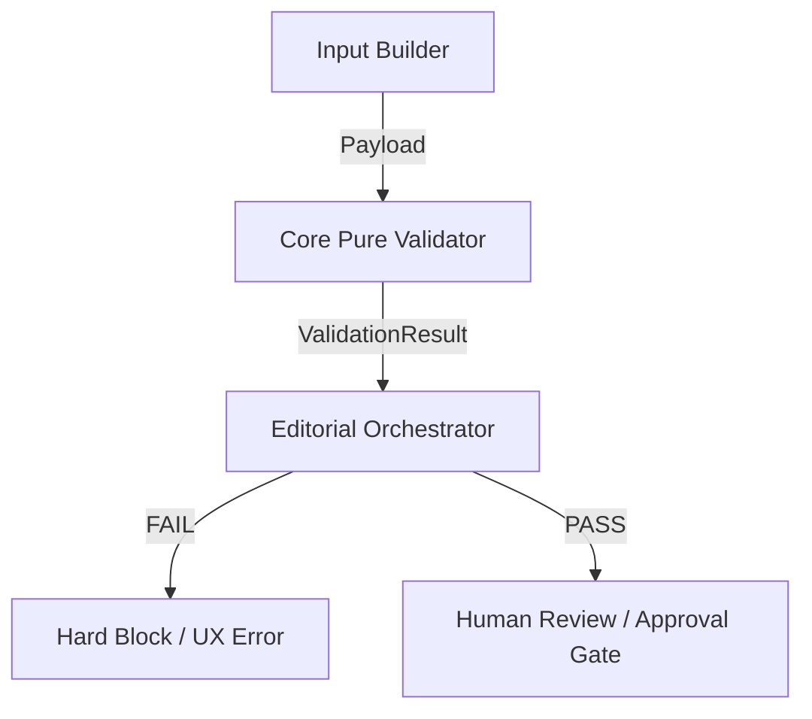

# Design Specification: Validator Integration Layer (8C-3A-3C-3)

## Overview

This document defines the integration layer for the **Core Pure Runtime Validator** (`validateCanonicalReAuditRegistrationPreviewAssessment`). It specifies how the validator interacts with higher-level editorial orchestration components while maintaining strict purity and separation of concerns.

---

## 1. Integration Topology

The validator sits between the **Input Builder** (data preparation) and the **Orchestrator** (decision making).

---

## 2. Component Roles

### 2.1 Input Source: `CanonicalReAuditInputBuilder`
- **Responsibility**: Gather raw data from various sources (Vault, Metadata, Session) and transform it into the `RegistrationPreviewAssessmentLike` shape.
- **Output**: An `unknown` object that matches the validator's expected schema.
- **Purity**: Remains pure; does not call the validator itself.

### 2.2 Call Site: `RegistrationOrchestrator`
- **Responsibility**: Orchestrate the workflow of registration preview and assessment.
- **Action**: Invokes `validateCanonicalReAuditRegistrationPreviewAssessment(payload)`.
- **Constraint**: Must be the *only* component that acts on the validation result for registration flows.

---

## 3. Control Flow Mechanics

### 3.1 FAIL (Blocking Flow)
- **Condition**: `ValidationResult.valid === false` or `errors.length > 0`.
- **System Action**: **HARD BLOCK**.
    - Prevents any state transition to "REGISTERED" or "PROMOTED".
    - Prevents creation of any mutation tokens.
    - Prevents any interaction with the Deploy Gate.
- **UX Action**: Map `StructuredError` messages and remediations directly to the UI.

### 3.2 PASS (Allowing Continuation)
- **Condition**: `ValidationResult.valid === true` and `errors.length === 0`.
- **System Action**: **TRANSITION TO HUMAN REVIEW**.
    - Allows the flow to proceed to the next human-led stage.
    - Does *not* automatically approve or publish.
    - The `SafetyFlag` array (e.g., `DEPLOY_UNLOCK_FORBIDDEN`) must be carried forward to ensure future layers remain aware of safety constraints.

---

## 4. Integration Constraints

- **Purity Maintenance**: The integration layer must not introduce side effects into the validator. The validator call must be wrapped in a way that its output is treated as read-only.
- **No Execution Power**: The validator result is advisory to the orchestrator. The orchestrator has the logic to "block", but the validator does not "stop" the system directly.
- **No Mutation**: The payload passed to the validator must be a deep clone or treated as immutable by the orchestrator.

---

## 5. Traceability Matrix

| Requirement | Design Solution |
| :--- | :--- |
| **Where called** | `RegistrationOrchestrator` (Editorial Layer) |
| **Input Source** | `CanonicalReAuditInputBuilder` (Data Layer) |
| **Consumption** | Mapped to `ValidationResult` UI and Orchestration State |
| **FAIL Flow** | Hard Block; No state transition; Error display |
| **PASS Flow** | Allow Human Review; Carry forward Safety Flags |
| **Purity** | Orchestrator handles validator as a pure sync function |
