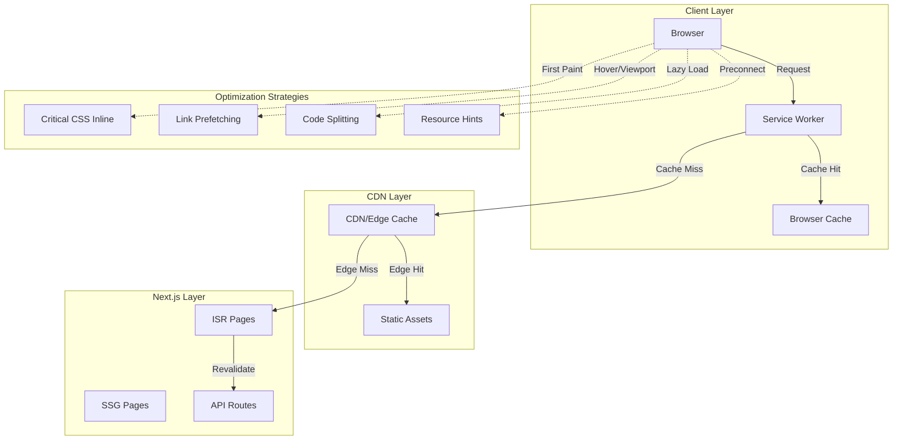
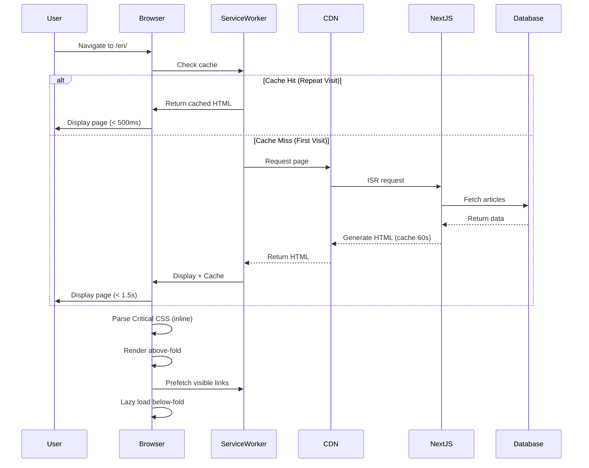

# Design Document: Performance Optimization Faz 3 (Advanced Optimizations)

## Overview

Performance Optimization Faz 3 implements advanced web performance techniques to achieve a Lighthouse Performance Score of 95+ (from current 88/100). This phase builds on Faz 1 (dynamic imports, font optimization) and Faz 2 (bundle analysis, third-party script optimization) by introducing ISR/SSG caching, critical CSS extraction, intelligent prefetching, service worker optimization, and advanced code splitting. The implementation follows a phased approach (3A: Quick Wins, 3B: Medium Effort, 3C: High Effort) to incrementally improve Core Web Vitals while maintaining all existing functionality.

## Architecture



## Main Workflow Sequence



## Components and Interfaces

### Component 1: ISR Configuration Module

**Purpose**: Configure Incremental Static Regeneration for pages to enable edge caching with automatic revalidation

**Interface**:
```typescript
// Page-level ISR configuration
export const revalidate: number = 60 // seconds

// Dynamic params configuration
export const dynamicParams: boolean = true

// generateStaticParams for pre-rendering
export async function generateStaticParams(): Promise<Array<{ lang: string }>> {
  return [
    { lang: 'en' },
    { lang: 'tr' },
    { lang: 'de' },
    // ... other languages
  ]
}
```

**Responsibilities**:
- Define revalidation intervals per page type
- Configure static path generation
- Enable edge caching behavior
- Balance freshness vs performance

**Revalidation Strategy**:
- Homepage: 60 seconds (high traffic, frequent updates)
- Article pages: 300 seconds (5 minutes, less frequent changes)
- Static pages: 3600 seconds (1 hour, rarely change)

---

### Component 2: Critical CSS Extractor

**Purpose**: Extract and inline critical above-the-fold CSS to eliminate render-blocking stylesheets

**Interface**:
```typescript
interface CriticalCSSConfig {
  base: string          // Base URL for extraction
  src: string           // Source HTML file
  target: string        // Output CSS file
  width: number         // Viewport width
  height: number        // Viewport height
  inline: boolean       // Inline in HTML
  minify: boolean       // Minify output
}

async function extractCriticalCSS(config: CriticalCSSConfig): Promise<string>

async function injectCriticalCSS(html: string, criticalCSS: string): Promise<string>
```

**Responsibilities**:
- Analyze above-the-fold content
- Extract critical CSS rules
- Inline CSS in `<head>`
- Defer non-critical CSS loading

---

### Component 3: Link Prefetch Manager

**Purpose**: Intelligently prefetch likely navigation targets to reduce perceived navigation time

**Interface**:
```typescript
interface PrefetchConfig {
  strategy: 'hover' | 'viewport' | 'idle'
  priority: 'high' | 'low'
  maxConcurrent: number
  throttleMs: number
}

interface PrefetchManager {
  prefetch(url: string, priority?: 'high' | 'low'): Promise<void>
  isPrefetched(url: string): boolean
  clearCache(): void
}

// React Hook
function usePrefetch(config?: Partial<PrefetchConfig>): PrefetchManager
```

**Responsibilities**:
- Monitor link hover events (desktop)
- Track viewport intersection (mobile)
- Throttle prefetch requests
- Manage prefetch queue priority
- Cache prefetched resources

**Prefetch Strategies**:
- **Hover**: Prefetch on mouseenter (desktop)
- **Viewport**: Prefetch when link enters viewport (mobile)
- **Idle**: Prefetch during browser idle time (low priority)

---

### Component 4: Service Worker Cache Manager

**Purpose**: Implement intelligent caching strategies for different resource types

**Interface**:
```typescript
interface CacheStrategy {
  cacheName: string
  maxEntries: number
  maxAgeSeconds: number
  handler: 'CacheFirst' | 'NetworkFirst' | 'StaleWhileRevalidate'
}

interface ServiceWorkerConfig {
  version: string
  cacheStrategies: Record<string, CacheStrategy>
  precacheAssets: string[]
}


// Service Worker implementation
self.addEventListener('fetch', (event: FetchEvent) => {
  const strategy = getStrategyForRequest(event.request)
  event.respondWith(strategy.handle(event.request))
})
```

**Responsibilities**:
- Implement cache-first for static assets
- Network-first for API requests
- Stale-while-revalidate for HTML pages
- Manage cache versioning and cleanup
- Handle offline scenarios

**Cache Strategies**:
- **Static Assets** (JS, CSS, images): CacheFirst, 1 year expiry
- **API Responses**: NetworkFirst, 5 minute expiry
- **HTML Pages**: StaleWhileRevalidate, 1 hour expiry
- **Fonts**: CacheFirst, permanent cache

---

### Component 5: Code Splitting Manager

**Purpose**: Advanced code splitting to reduce initial bundle size and improve TBT

**Interface**:
```typescript
// Dynamic import with loading state
const DynamicComponent = dynamic(() => import('@/components/Heavy'), {
  loading: () => <Skeleton />,
  ssr: false
})

// Route-based splitting
const AdminPanel = dynamic(() => import('@/components/admin/Panel'), {
  ssr: false,
  loading: () => <AdminSkeleton />
})

// Conditional loading
const ChartLibrary = dynamic(() => 
  import('recharts').then(mod => ({ default: mod.LineChart })),
  { ssr: false }
)
```

**Responsibilities**:
- Split large libraries into separate chunks
- Lazy load below-fold components
- Defer admin-only components
- Optimize vendor bundle splitting

---

### Component 6: Resource Hint Manager

**Purpose**: Optimize resource loading priority with preload, prefetch, and preconnect hints

**Interface**:
```typescript
interface ResourceHint {
  rel: 'preload' | 'prefetch' | 'preconnect' | 'dns-prefetch'
  href: string
  as?: 'font' | 'script' | 'style' | 'image'
  type?: string
  crossOrigin?: 'anonymous' | 'use-credentials'
}

function generateResourceHints(page: string): ResourceHint[]

```

**Responsibilities**:
- Preload critical fonts
- Preconnect to external domains
- Prefetch likely next pages
- DNS prefetch for third-party domains

**Resource Hint Strategy**:
- **Preload**: Critical fonts, hero images (< 3 resources)
- **Preconnect**: Google Fonts, Analytics domains
- **Prefetch**: Next likely navigation targets
- **DNS Prefetch**: Third-party tracking domains

---

## Data Models

### Model 1: ISR Configuration

```typescript
interface ISRConfig {
  revalidate: number           // Seconds until revalidation
  dynamicParams: boolean       // Allow dynamic route params
  generateStaticParams?: () => Promise<Array<Record<string, string>>>
}

interface PageISRConfig {
  homepage: ISRConfig
  articlePage: ISRConfig
  categoryPage: ISRConfig
  staticPage: ISRConfig
}

const isrConfig: PageISRConfig = {
  homepage: {
    revalidate: 60,
    dynamicParams: true,
    generateStaticParams: async () => SUPPORTED_LANGUAGES.map(lang => ({ lang }))
  },
  articlePage: {
    revalidate: 300,
    dynamicParams: true
  },
  categoryPage: {
    revalidate: 180,
    dynamicParams: true
  },
  staticPage: {
    revalidate: 3600,
    dynamicParams: false
  }
}
```

**Validation Rules**:
- revalidate must be > 0 (0 = no caching)
- generateStaticParams required for pre-rendering
- dynamicParams = true allows runtime generation

---

### Model 2: Cache Manifest

```typescript
interface CacheEntry {
  url: string
  version: string
  timestamp: number
  expiresAt: number
  strategy: 'CacheFirst' | 'NetworkFirst' | 'StaleWhileRevalidate'
}

interface CacheManifest {
  version: string
  entries: CacheEntry[]
  precache: string[]
  runtimeCache: Record<string, CacheStrategy>
}


const cacheManifest: CacheManifest = {
  version: 'v3.0.0',
  entries: [],
  precache: [
    '/',
    '/en/',
    '/manifest.json',
    '/icon.svg'
  ],
  runtimeCache: {
    images: {
      cacheName: 'images-v3',
      maxEntries: 100,
      maxAgeSeconds: 30 * 24 * 60 * 60, // 30 days
      handler: 'CacheFirst'
    },
    api: {
      cacheName: 'api-v3',
      maxEntries: 50,
      maxAgeSeconds: 5 * 60, // 5 minutes
      handler: 'NetworkFirst'
    }
  }
}
```

**Validation Rules**:
- Version must follow semver format
- maxEntries prevents unbounded cache growth
- maxAgeSeconds ensures fresh content
- Precache list should be minimal (< 10 URLs)

---

### Model 3: Prefetch Queue

```typescript
interface PrefetchRequest {
  url: string
  priority: 'high' | 'low'
  timestamp: number
  status: 'pending' | 'loading' | 'complete' | 'failed'
}

interface PrefetchQueue {
  queue: PrefetchRequest[]
  maxConcurrent: number
  active: number
  completed: Set<string>
}

const prefetchQueue: PrefetchQueue = {
  queue: [],
  maxConcurrent: 3,
  active: 0,
  completed: new Set()
}
```

**Validation Rules**:
- maxConcurrent limits network congestion (2-4 optimal)
- High priority requests processed first
- Duplicate URLs skipped via completed Set
- Failed requests retried once after 5s

---

### Model 4: Critical CSS Extraction Result

```typescript
interface CriticalCSSResult {
  css: string
  originalSize: number
  criticalSize: number
  reductionPercent: number
  extractionTime: number
}


interface CriticalCSSConfig {
  viewportWidth: number
  viewportHeight: number
  minify: boolean
  inline: boolean
  ignore: string[]
}
```

**Validation Rules**:
- criticalSize should be < 14KB (HTTP/2 first round trip)
- reductionPercent target: > 70%
- extractionTime should be < 5s
- Inline only if criticalSize < 14KB

---

## Algorithmic Pseudocode

### Algorithm 1: ISR Page Generation with Revalidation

```pascal
ALGORITHM generateISRPage(request)
INPUT: request of type PageRequest
OUTPUT: response of type PageResponse

BEGIN
  // Step 1: Check if cached version exists and is fresh
  cachedPage ← cache.get(request.url)
  currentTime ← getCurrentTimestamp()
  
  IF cachedPage ≠ NULL AND (currentTime - cachedPage.timestamp) < revalidateInterval THEN
    // Cache hit - return immediately
    RETURN cachedPage.html
  END IF
  
  // Step 2: Generate fresh page (cache miss or stale)
  data ← fetchArticlesFromDatabase()
  html ← renderPageWithData(data)
  
  // Step 3: Cache the generated page
  cache.set(request.url, {
    html: html,
    timestamp: currentTime,
    expiresAt: currentTime + revalidateInterval
  })
  
  // Step 4: If stale cache exists, return it while revalidating in background
  IF cachedPage ≠ NULL THEN
    // Stale-while-revalidate pattern
    scheduleBackgroundRevalidation(request.url)
    RETURN cachedPage.html
  END IF
  
  RETURN html
END
```

**Preconditions**:
- revalidateInterval is configured (> 0)
- Cache storage is available
- Database connection is active

**Postconditions**:
- Fresh HTML is returned
- Cache is updated with new content
- Stale content served immediately if available

**Loop Invariants**: N/A (no loops)

---

### Algorithm 2: Critical CSS Extraction

```pascal
ALGORITHM extractCriticalCSS(htmlContent, stylesheets)
INPUT: htmlContent of type String, stylesheets of type Array<String>
OUTPUT: criticalCSS of type String

BEGIN
  // Step 1: Parse HTML and build DOM tree
  dom ← parseHTML(htmlContent)
  viewport ← { width: 1920, height: 1080 }
  
  // Step 2: Identify above-the-fold elements
  aboveFoldElements ← []
  FOR each element IN dom.body DO
    elementPosition ← calculatePosition(element)
    IF elementPosition.top < viewport.height THEN
      aboveFoldElements.add(element)
    END IF
  END FOR
